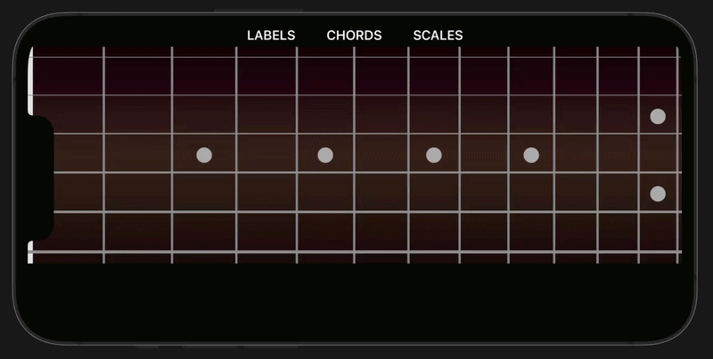

# Swift Version: Learn chord and scale positions on the Guitar

Visualize the notes on a fretboard



---

## Table of Contents
* [Requirements](#requirements)
* [Installation](#installation)
* [Usage](#usage)

---

## Requirements

* Xcode 15.0+
* iOS 17.0+
* Mac running macOS Sonoma or later 

---

## Installation 
1.  **Clone the repository:**
    ```bash
    git clone https://github.com/seanavers/fretboard-heatmap.git
    ```
2. **Open the project:**
   ```bash
   FretboardHeatmap.xcodeproj.
   ```
   
---

## Usage
1.  **Open the app**
2.  **Tap CHORDS or SCALES to select desired type**
3.  **Tap Bottom Menu to display desired root** 
4.  **Tap LABELS to toggle note labels**
    -   finger numbers for chords, note names for scales
5.  **Click Dropdown to selected desired key**
    
**Note: When switching to a new desired type, the Bottom Menu will match your current key** 

